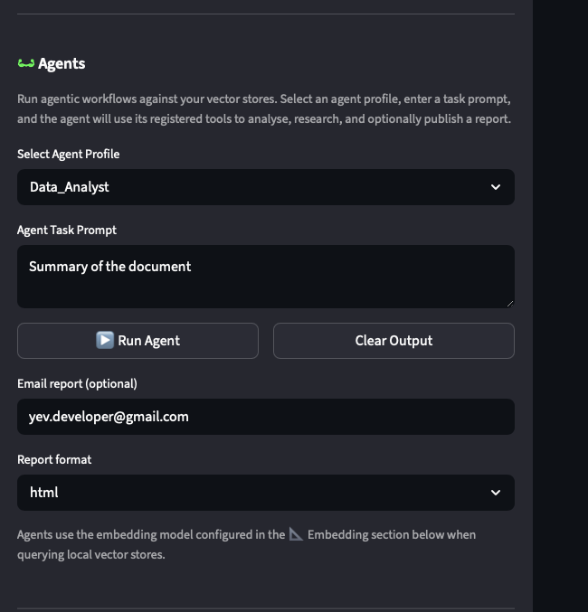

# AI Financial Analysis

Streamlit dashboard for question-and-answer over financial documents, powered by
retrieval-augmented generation (RAG), FAISS vector search, and an **agentic framework**
for multi-agent research workflows, thematic investment analysis, and report publishing.

This repository is a practical exploration of AI-enabled financial analysis — running
models locally with **Ollama**, using **GitHub Models / Copilot** as a cost-effective
hosted option, and orchestrating agents that can analyse, cross-reference, and publish
research autonomously.

Architecture note: this project is built around a RAG + embeddings pipeline.
RAG (Retrieval-Augmented Generation) means the app first retrieves relevant document
chunks for a question, then passes that context to the LLM to generate a grounded answer.
Embeddings are numeric vector representations of text that capture semantic meaning, so
similar questions and passages are close in vector space. We store and search those vectors
with FAISS (Facebook AI Similarity Search), which powers fast nearest-neighbor retrieval.


---

## Agentic Framework

The `src/fin_ai/agents/` package provides a multi-agent orchestration framework built
on Microsoft **AutoGen**.  Agents are configurable, tool-aware, and can communicate
with each other and with the local RAG infrastructure.



### Agent Library

| Agent | Role | Key Tools |
|-------|------|-----------|
| **Data_Analyst** | Quantitative analysis of financial statements | `get_income_stmt`, `get_balance_sheet`, `get_cash_flow`, `get_financial_snapshot`, RAG query |
| **Market_Analyst** | Market data, sentiment, analyst consensus | `get_stock_data`, `get_analyst_recommendations`, `get_stock_info`, RAG query |
| **Research_Analyst** | Deep-dive company research (full toolkit) | All YFinance tools + RAG + citations |
| **Thematic_Investor** | Theme-based evaluation (AI, energy transition) | Financials + RAG + thematic scoring |
| **Research_Publisher** | Format, publish, and distribute research | `publish_research_html`, `publish_research_pdf`, `send_research_email` |

### How agents work

```
User prompt → FinRobot / SingleAssistantRAG
                  │
                  ▼
          Tool Resolution Layer
     (fin_ai.core.tools + engine_bridge)
      ┌──────────────────────────────┐
      │  • get_stock_info            │
      │  • get_income_stmt           │
      │  • query_local_rag           │
      │  • publish_research_report   │
      │  • list_available_models     │
      │  • ...                       │
      └──────────────┬───────────────┘
                     ▼
             LLM reasoning
                     │
                     ▼
           Answer + optional publish
```

Each agent automatically discovers and registers its tools from `fin_ai.core.tools`
(YFinance data functions) and `fin_ai.agents.engine_bridge` (local RAG, model listing,
publishing).  Tool registration is string-based — agents declare tool names in their
profile and `FinRobot.register_proxy()` resolves them via `register_tools()`.

### Agent Pipeline & Scheduler

For multi-step, multi-agent workflows with dependency resolution:

```python
from fin_ai.agents.scheduler import AgentTask, AgentPipeline, AgentScheduler

pipeline = AgentPipeline("Weekly Review", llm_config=llm_config)
pipeline.add_task(AgentTask("analyze_aapl", prompt="Analyse AAPL",
                            agent_config="Data_Analyst"))
pipeline.add_task(AgentTask("synthesize", prompt="Compare results",
                            agent_config="Financial_Analyst",
                            depends_on=["analyze_aapl"]))
pipeline.run()

# Or schedule recurring execution:
scheduler = AgentScheduler([pipeline], interval_seconds=86400)
scheduler.start()
```

See `src/fin_ai/agents/scheduler.py`.

---

## Dashboard Interaction

The Streamlit dashboard (`financial_analyst_dashboard.py`) integrates the agentic
framework directly in the sidebar alongside the standard RAG query interface:

```
┌──────────────────────────────────────────────────┐
│  Sidebar                                          │
│  ┌──────────────────────────────────────────────┐ │
│  │  Reasoning (LLM provider + model)          │ │
│  ├──────────────────────────────────────────────┤ │
│  │ 🕶 Agents                                   │ │
│  │  • Select agent profile (dropdown)           │ │
│  │  • Enter task prompt (text area)             │ │
│  │  • Optional: email + HTML/PDF format         │ │
│  │  • [▶ Run Agent]  [Clear Output]             │ │
│  ├──────────────────────────────────────────────┤ │
│  │ 📐 Embedding (model selection)               │ │
│  └──────────────────────────────────────────────┘ │
│                                                    │
│  Main panel                                        │
│  ┌──────────────────────────────────────────────┐ │
│  │ 🤖 Agent Response (Markdown with citations)  │ │
│  │ 📄 Publication Result (JSON summary)          │ │
│  └──────────────────────────────────────────────┘ │
└──────────────────────────────────────────────────────┘
```

**Workflow from the dashboard:**
1. Upload documents via the existing upload section (PDF, CSV, JSON, HTML, DOCX)
2. Select an **Agent Profile** from the sidebar dropdown
3. Enter a task prompt — e.g. *"Analyse NVDA's competitive position using RAG"*
4. Optionally enter an email address and choose HTML or PDF format
5. Click **Run Agent**
6. The agent retrieves relevant context from local FAISS stores, queries live YFinance
   data if needed, and produces a structured answer
7. If `Research_Publisher` is selected, the report is saved to `published_research/`
   and emailed to the provided address
8. Both the agent response and publication result are displayed in the main panel

---

## Architecture

```
                     ┌──────────────────────────┐
                     │   Streamlit Dashboard     │
                     │  (financial_analyst_      │
                     │   dashboard.py)           │
                     └──────┬──────────┬─────────┘
                            │          │
                    ┌───────┘          └───────┐
                    ▼                          ▼
        ┌────────────────────┐   ┌──────────────────────────┐
        │  RAG Engine         │   │  Agentic Framework       │
        │  (fin_ai_engine)   │   │  (fin_ai/agents/)        │
        │                    │   │                          │
        │  ┌──────────────┐  │   │  ┌────────────────────┐  │
        │  │ FAISS Vector │  │   │  │ FinRobot           │  │
        │  │ Stores       │  │   │  │ SingleAssistant    │  │
        │  └──────────────┘  │   │  │ SingleAssistantRAG │  │
        │                    │   │  │ AgentPipeline      │  │
        │  ┌──────────────┐  │   │  │ AgentScheduler     │  │
        │  │ answer_      │  │   │  │ Research_Publisher │  │
        │  │ question()   │  │   │  └────────────────────┘  │
        │  └──────────────┘  │   └──────────────────────────┘
        └────────────────────┘
                    │                          │
                    └──────────┬───────────────┘
                               ▼
            ┌──────────────────────────────────────┐
            │  Tool Resolution Layer                │
            │  (fin_ai.core.tools + engine_bridge)  │
            │                                      │
            │  YFinance tools          RAG tools   │
            │  ┌──────────────────┐   ┌─────────┐  │
            │  │ get_stock_info   │   │query_   │  │
            │  │ get_income_stmt  │   │local_rag│  │
            │  │ get_balance_sheet│   │list_    │  │
            │  │ get_cash_flow    │   │vector_  │  │
            │  │ get_stock_data   │   │stores   │  │
            │  │ get_analyst_recs │   └─────────┘  │
            │  └──────────────────┘                │
            │                                      │
            │  Publishing tools                    │
            │  ┌────────────────────────────────┐  │
            │  │ publish_research_html          │  │
            │  │ publish_research_pdf           │  │
            │  │ publish_research_report        │  │
            │  │ send_research_email            │  │
            │  └────────────────────────────────┘  │
            └──────────────────────────────────────┘
```

---

## Research Publishing

The `Research_Publisher` agent and the underlying tools in `fin_ai.core.tools` produce
professional reports:

- **HTML reports** — Jinja2-templated with professional CSS, Markdown-to-HTML conversion,
  auto-generated metadata, and disclaimer footer
- **PDF reports** — via weasyprint (true PDF) or fallback to print-ready HTML
- **Email distribution** — SMTP-based with HTML body + file attachment
- Output directory: `published_research/`

### SMTP Configuration (Gmail)

```bash
export AI_RESEARCH_SMTP_HOST=smtp.gmail.com
export AI_RESEARCH_SMTP_PORT=587
export AI_RESEARCH_SMTP_USER=your@gmail.com
export AI_RESEARCH_SMTP_PASSWORD=your-gmail-app-password
```

---

## How it works

Two paths for answering questions:

```
Path A — Direct RAG (no agent):
  User query → retrieve from FAISS → LLM → Answer + citations

Path B — Agentic (with agent):
  User prompt → Agent (tool-equipped LLM) → RAG + YFinance + reasoning
    → Answer → [optional: publish_research_report → email]
```

### Retrieval modes

- `separate` — query each source independently, keep results grouped
- `ensemble` — merge and re-rank results using weighted fusion (best overall evidence)
- `routed` — select a subset of likely-relevant sources first (faster, focused)

---

## Project structure

```
src/
├── fin_ai/
│   ├── __init__.py
│   ├── agents/
│   │   ├── __init__.py           # Public exports
│   │   ├── agent_library.py       # Agent profiles & tool assignments
│   │   ├── agentic_rag.py         # AutoGen RAG function factory
│   │   ├── engine_bridge.py       # RAG + model + publishing tools for agents
│   │   ├── multi_company_rag.py   # Multi-ticker RAG engine
│   │   ├── prompts.py             # System prompts for leader/role patterns
│   │   ├── scheduler.py           # AgentTask, AgentPipeline, AgentScheduler
│   │   ├── utils.py               # Order/trigger helpers
│   │   └── workflow.py            # FinRobot, SingleAssistant, MultiAssistant
│   └── core/
│       ├── fin_ai_engine.py       # RAG query engine
│       ├── providers.py           # Model listing (Ollama, GitHub, DeepSeek)
│       ├── query.py               # Multi-source retrieval & routing
│       ├── rag.py                 # FAISS indexing & document loading
│       ├── request.py             # LiteLLM client + request pipeline
│       ├── response.py            # Response metadata & formatting
│       └── tools.py               # YFinance tools + publishing functions
├── dashboard/
│   ├── __init__.py                # Configuration & paths
│   ├── utils.py                   # Embeddings, PDF/CSV rendering
│   ├── financial_analyst_app.py   # Compatibility entry point
│   └── financial_analyst_dashboard.py  # Streamlit UI
├── published_research/            # Agent-generated reports
└── vector_db/                     # FAISS indexes stored here
```

---

## Quick start

```bash
# 1. Create environment
conda create -n fin_ai python=3.11 -y
conda activate fin_ai

# 2. Install dependencies
pip-sync requirements.txt

# 3. Run the dashboard
streamlit run dashboard/financial_analyst_dashboard.py
```

Or use the provided scripts:

```bash
./start_dashboard.sh       # macOS/Linux
start_dashboard.bat        # Windows
```

## Prerequisites

- Python 3.11 (recommended)
- Ollama installed and running (for local chat + embedding models)
- Optional: `poppler` for PDF previews (`brew install poppler` on macOS)

## Dependency management

```bash
# Update top-level dependencies in requirements.in, then:
pip-compile requirements.in -o requirements.txt
pip-sync requirements.txt
```

## Related

- [AutoGen](https://github.com/microsoft/autogen) — Multi-agent conversation framework
  from Microsoft Research
- [FAISS](https://github.com/facebookresearch/faiss) — Facebook AI Similarity Search
