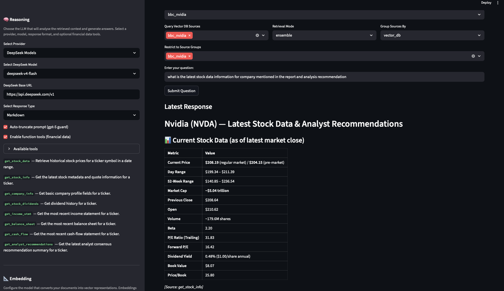
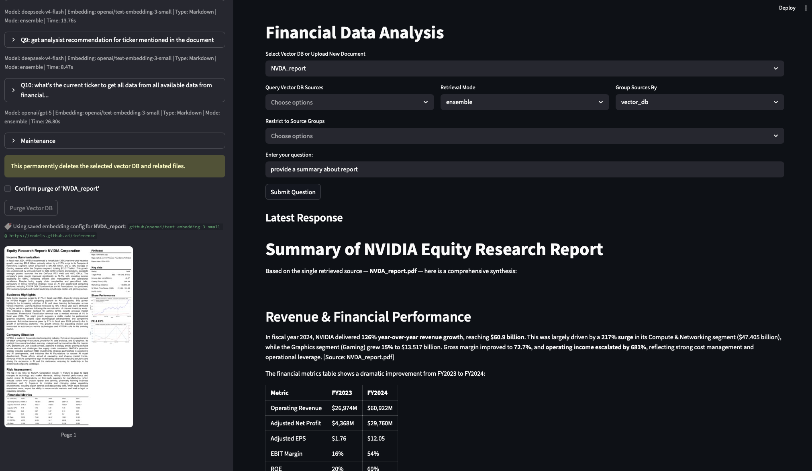

# AI Financial Analysis

Streamlit  Dashboard app for question-and-answer over financial documents, designed as a lightweight
research playground for experimenting with local and remote LLMs, retrieval-augmented
generation (RAG), and FAISS-based vector search.

This repository is also a collection of practical explorations across AI model approaches,
tools, and libraries. A key focus is cost-effective development: running models locally with
the Ollama suite when possible, and using GitHub Copilot and GitHub Models as an affordable
hosted option when local execution is not the best fit.

This repository provides a Streamlit UI to upload or point to PDFs and text documents,
index them with embeddings, and run semantic search + LLM-based answers with source
citation and optional PDF page previews.

Architecture note: this project is built around a RAG + embeddings pipeline.
RAG (Retrieval-Augmented Generation) means the app first retrieves relevant document
chunks for a question, then passes that context to the LLM to generate a grounded answer.
Embeddings are numeric vector representations of text that capture semantic meaning, so
similar questions and passages are close in vector space. We store and search those vectors
with FAISS (Facebook AI Similarity Search), which powers fast nearest-neighbor retrieval.

## Projects

1. LiteLLM Dashboard

Cost-effective way to run queries against GitHub Copilot/GitHub Models or local
Ollama models through LiteLLM, with a single interface for provider switching.

2. Financial Analysis of Research Paper

Exploration of end-to-end RAG workflows for financial documents: indexing,
embeddings selection, vector retrieval, and question-answer analysis.

### Research Analysis Dashboard

Query indexed financial documents (PDFs, text files) and get LLM-grounded answers
with source citations. The dashboard also connects to live Yahoo Finance data via
external tools — the LLM framework understands how to fetch and incorporate
real-time market data into its answers.



*Query panel with external tool connectivity — ask questions about indexed documents
and retrieve live financial data simultaneously.*



*Full document Q&A interface for research papers — upload, index, and query financial
reports with source-cited answers.*

## How it works

Simple flow (high-level):

User documents (PDF / text) -> chunker/cleaner -> embeddings (Ollama or remote) -> FAISS index
-> retriever -> LLM (Ollama or remote) -> Answer + citations / page snippets

ASCII diagram:

	[User] -> [Streamlit UI] -> [Chunker & Indexer] -> [Embeddings Provider]
																				 -> [FAISS index]
	[Query] -> [Retriever] -> [LLM] -> [Answer + Sources]

### Retrieval modes

The app supports three retrieval modes for multi-source question answering:

- `separate`: Queries each selected source independently and keeps results grouped by source.
	This is useful when you want source-by-source visibility and explicit cross-source comparison.
- `ensemble`: Queries selected sources, then merges and re-ranks results into one combined context
	using weighted fusion. This is useful when you want the strongest overall evidence regardless of
	which source it came from.
- `routed`: First chooses a smaller subset of likely relevant sources (heuristic routing or optional
	LLM planner), then retrieves from only those sources. This is useful for faster, more focused
	retrieval on broad source sets.

How they differ in approach:

- Scope of retrieval: `separate` and `ensemble` use all selected sources, while `routed` narrows
	to a subset before retrieval.
- Evidence organization: `separate` preserves per-source structure; `ensemble` blends evidence
	into a single ranked set; `routed` returns evidence from routed sources only.
- Typical tradeoff: `separate` gives transparency, `ensemble` gives strongest aggregate relevance,
	and `routed` gives efficiency and focus.


## Configuration examples

Switching providers is done by selecting which embeddings/LLM endpoint to use. Example
configuration (YAML):

```yaml
# Use either 'ollama' or 'remote' here
model_provider: ollama

ollama:
	# Ollama server base URL (default local)
	url: "http://localhost:11434"
	chat_model: "llama2-chat"        # model name used for chat/generation
	embedding_model: "llama2-embedding"  # model name used for embeddings

github:
	# Example GitHub-hosted model configuration. Replace values with the
	# model repo/identifier and the environment variable holding your GitHub token.
	# This assumes you are using a GitHub Models / Inference endpoint or a
	# self-hosted inference gateway that accepts a repo identifier.
	repo: "owner/model-name"           # e.g. 'my-org/finance-qa-model'
	inference_url: "https://api.github.com/models/{owner}/{model}/infer"
	token_env: "GITHUB_TOKEN"         # store token in env var
	model: "v1.0"                     # provider-specific model tag
	embedding_model: "embed-v1"       # embedding model name if separate
```

To switch between Ollama (local) and a remote provider, set `model_provider` to
`ollama` or `remote` and populate the corresponding section with connection details.


## Prerequisites

- Python 3.11 (recommended)
- Conda (optional, if you prefer Conda environments)
- Ollama installed and running (for chat and embedding models)
- Optional system dependency for PDF previews:
	- macOS: `brew install poppler`
	- Ubuntu/Debian: `sudo apt-get install poppler-utils`

## Install dependencies with pip-tools

This project uses:

- `requirements.in` for top-level dependencies
- `requirements.txt` for fully resolved, pinned dependencies generated by `pip-compile`

### 1. Create and activate an environment

Option A: `.venv`

macOS/Linux:

```bash
python3.11 -m venv .venv
source .venv/bin/activate
```

Windows (PowerShell):

```powershell
py -3.11 -m venv .venv
.venv\Scripts\Activate.ps1
```

Option B: Conda environment

macOS/Linux/Windows:

```bash
conda create -n fin_ai python=3.11 -y
conda activate fin_ai
```

### 2. Install pip-tools

```bash
python -m pip install --upgrade pip pip-tools
```

### 3. Resolve dependencies with pip-compile

```bash
pip-compile requirements.in -o requirements.txt
```

Notes:

- This step resolves transitive dependencies and pins exact versions.
- Commit both `requirements.in` and `requirements.txt` after changes.

### 4. Sync your environment to the lock file

```bash
pip-sync requirements.txt
```

`pip-sync` installs missing packages and removes extras so your environment exactly matches `requirements.txt`.

## Run the app

From this folder:

macOS/Linux:

```bash
./start_dashboard.sh
```

Windows:

```bat
start_dashboard.bat
```

Alternative:

```bash
python -m streamlit run app.py
```

If you used Conda, make sure the environment is active before running:

```bash
conda activate ai_financial_analysis
python -m streamlit run app.py
```

## Updating dependencies

1. Edit `requirements.in`.
2. Re-resolve and pin:

```bash
pip-compile requirements.in -o requirements.txt
```

3. Apply the updated lock file:

```bash
pip-sync requirements.txt
```

### Upgrade all packages

```bash
pip-compile --upgrade requirements.in -o requirements.txt
pip-sync requirements.txt
```

### Upgrade one package

```bash
pip-compile --upgrade-package langchain requirements.in -o requirements.txt
pip-sync requirements.txt
```

## Windows Guide

Use this section if you are running the project on Windows.

### Prerequisites (Windows)

- Python 3.11
- Conda (optional, if you prefer Conda environments)
- Ollama installed and running
- Optional for PDF page rendering: Poppler

Install Poppler with Chocolatey:

```powershell
choco install poppler
```

### PowerShell setup

```powershell
py -3.11 -m venv .venv
.venv\Scripts\Activate.ps1
python -m pip install --upgrade pip pip-tools
pip-compile requirements.in -o requirements.txt
pip-sync requirements.txt
```

### PowerShell setup (Conda)

```powershell
conda create -n ai_financial_analysis python=3.11 -y
conda activate ai_financial_analysis
python -m pip install --upgrade pip pip-tools
pip-compile requirements.in -o requirements.txt
pip-sync requirements.txt
```

If activation is blocked, run once in an elevated PowerShell:

```powershell
Set-ExecutionPolicy -ExecutionPolicy RemoteSigned -Scope CurrentUser
```

### CMD setup

```bat
py -3.11 -m venv .venv
.venv\Scripts\activate.bat
python -m pip install --upgrade pip pip-tools
pip-compile requirements.in -o requirements.txt
pip-sync requirements.txt
 pip install watchdog
```

### CMD setup (Conda)

```bat
conda create -n ai_fin python=3.11 -y
conda activate ai_fin
python -m pip install --upgrade pip pip-tools
pip-compile requirements.in -o requirements.txt
pip-sync requirements.txt
```

### Run on Windows

```bat
start_dashboard.bat
```

Or directly:

```powershell
python -m streamlit run app.py
```

Or with Conda activated: 

```powershell
conda activate ai_fin
python -m streamlit run app.py
```

### Sample Research Papers

[Sample Research](<https://mergersandinquisitions.com/equity-research-report/#:~:text=You%20can%20get%20the%20reports,here)%20has%20the%20following%20components:>)

### References

[Finding the Best Open-Source Embedding Model for RAG](https://www.tigerdata.com/blog/finding-the-best-open-source-embedding-model-for-rag)