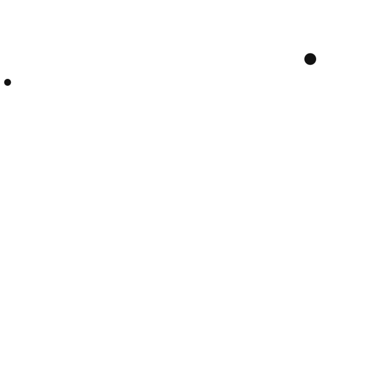
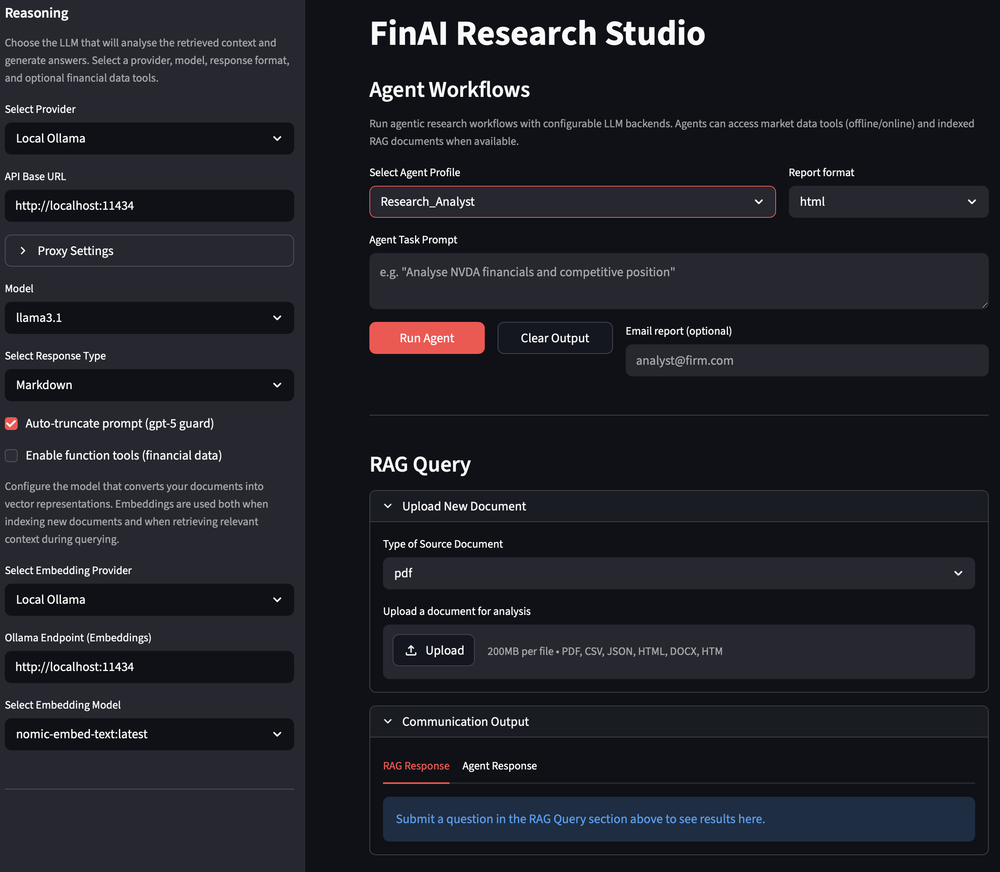
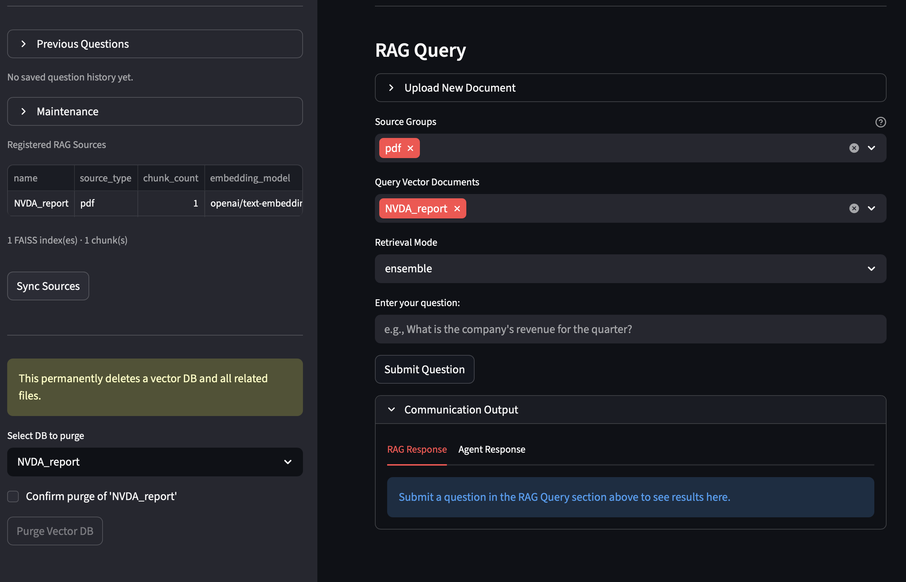

# FinAI Research Studio

A Streamlit-based research platform for AI-powered financial analysis — combining
**retrieval-augmented generation (RAG)** over financial documents, an **agentic framework**
for multi-agent research workflows, and **offline market data** via pre-downloaded Yahoo
Finance sources.



---

## Overview

FinAI Research Studio lets you:



- **Upload financial documents** (PDF, CSV, JSON, HTML, DOCX) and index them into FAISS
  vector stores for semantic search
- **Query documents** with LLM-powered RAG across multiple sources, grouped by type
  (source groups like `pdf`, `csv`, `json`) or by individual document
- **Run agentic workflows** using AutoGen-powered agents that can combine RAG context
  with live or offline market data
- **Publish research reports** as HTML or PDF and distribute them via email
- **Work offline** with pre-downloaded Yahoo Finance data served through a
  pluggable `MarketDataService` abstraction

Architecture note: this project is built around a RAG + embeddings pipeline.
RAG (Retrieval-Augmented Generation) retrieves relevant document chunks for a question,
then passes that context to the LLM to generate a grounded answer.
Embeddings are numeric vector representations of text that capture semantic meaning —
similar questions and passages are close in vector space. Vectors are stored and searched
with **FAISS** (Facebook AI Similarity Search).




---

## Agentic Framework

The `src/fin_ai/agents/` package provides a multi-agent orchestration framework built
on Microsoft **AutoGen** (AG2). Agents are configurable, tool-aware, and can communicate
with each other and with the local RAG infrastructure.


### Agent Library

| Agent | Role | Key Tools |
|-------|------|-----------|
| **Data_Analyst** | Quantitative analysis of financial statements | `get_income_stmt`, `get_balance_sheet`, `get_cash_flow`, `get_financial_snapshot`, RAG query |
| **Market_Analyst** | Market data, sentiment, analyst consensus | `get_stock_data`, `get_analyst_recommendations`, `get_stock_info`, RAG query |
| **Research_Analyst** | Deep-dive company research (full toolkit) | All YFinance tools + RAG + publishing |
| **Thematic_Investor** | Theme-based evaluation (AI, energy transition) | Financials + RAG + thematic scoring |
| **Research_Publisher** | Format, publish, and distribute research | `publish_research_html`, `publish_research_pdf`, `send_research_email` |
| **Test_Agent** | Diagnostics and introspection | `list_agent_profiles`, `list_vector_stores`, `get_provider_info` |

### How agents work

```
User prompt → AIAgent / SingleAssistant
                  │
                  ▼
          Tool Resolution Layer
     (fin_ai.core.tools + engine_bridge)
      ┌──────────────────────────────┐
      │  • get_stock_info            │
      │  • get_income_stmt           │
      │  • query_local_rag           │
      │  • publish_research_report   │
      │  • list_available_models     │
      │  • ...                       │
      └──────────────┬───────────────┘
                     ▼
             LLM reasoning (Ollama / GitHub / DeepSeek)
                     │
                     ▼
           Answer + optional publish
```

Each agent discovers and registers its tools from `fin_ai.core.tools` (YFinance data
functions) and `fin_ai.agents.engine_bridge` (local RAG, model listing, publishing).
Tool registration is string-based — agents declare tool names in their profile.

### Agent Pipeline & Scheduler

For multi-step, multi-agent workflows with dependency resolution:

```python
from fin_ai.agents.scheduler import AgentTask, AgentPipeline

pipeline = AgentPipeline("Weekly Review", llm_config=llm_config)
pipeline.add_task(AgentTask("analyze_aapl", prompt="Analyse AAPL",
                            agent_config="Data_Analyst"))
pipeline.add_task(AgentTask("synthesize", prompt="Compare results",
                            agent_config="Research_Analyst",
                            depends_on=["analyze_aapl"]))
pipeline.run()
```

---

## Market Data Service

Yahoo Finance data is served through a pluggable `MarketDataService` abstraction:

| Service | Backend | When used |
|---------|---------|-----------|
| `OnlineMarketDataService` | Live `yfinance` API | `YAHOO_SERVICE_OFFLINE=false` |
| `OfflineMarketDataService` | Pre-downloaded files in `data/<SYMBOL>/` | Default (`YAHOO_SERVICE_OFFLINE=true`) |

Download data for offline use:

```bash
python scripts/yahoo_finance_download.py --tickers AAPL,MSFT,NVDA \
    --start 2024-01-01 --end 2025-12-31 --format parquet
```

The download script creates organised ticker directories:

```
data/
├── AAPL/
│   ├── stock_data.parquet
│   ├── stock_info.parquet
│   ├── company_info.parquet
│   ├── dividends.parquet
│   ├── income_stmt.parquet
│   ├── balance_sheet.parquet
│   ├── cash_flow.parquet
│   └── analyst_recommendations.parquet
├── MSFT/
└── ...
```

---

## Dashboard


The **FinAI Research Studio** dashboard (`financial_analyst_dashboard.py`) organises
functionality into sidebar sections and a main panel:

### Sidebar

| Section | Purpose |
|---------|---------|
| **Reasoning** | LLM provider & model selection (Ollama, GitHub, DeepSeek, proxied endpoints) |
| **Embedding** | Embedding model configuration for document indexing |
| **Previous Questions** | History of past queries (shown when vector stores exist) |
| **Maintenance** | RAG source registry table, sync from disk, purge vector DB |

### Main Panel

| Section | Purpose |
|---------|---------|
| **Agent Workflows** | Select agent profile, enter task prompt, run agent with optional email delivery |
| **RAG Query** | Upload documents, select source groups & documents, ask questions |

**Workflow:**
1. Configure LLM provider and embedding model in the sidebar
2. Upload documents (PDF, CSV, JSON, HTML, DOCX) via the expandable upload section
3. Select source groups and specific documents to query
4. Ask questions in natural language — the system retrieves relevant context via RAG
5. Or run an agentic workflow: select an agent profile, enter a task prompt, and let the
   agent combine RAG context with market data tools
6. Publish research as HTML/PDF and optionally email it

---

## Architecture

```
                     ┌──────────────────────────┐
                     │    Streamlit Dashboard    │
                     │  (financial_analyst_      │
                     │   dashboard.py)           │
                     └──────┬──────────┬─────────┘
                            │          │
                    ┌───────┘          └───────┐
                    ▼                          ▼
        ┌────────────────────┐   ┌──────────────────────────┐
        │  RAG Engine         │   │  Agentic Framework       │
        │  (fin_ai.core/)    │   │  (fin_ai/agents/)        │
        │                    │   │                          │
        │  ┌──────────────┐  │   │  ┌────────────────────┐  │
        │  │ FAISS Vector │  │   │  │ AIAgent /          │  │
        │  │ Stores       │  │   │  │ SingleAssistant    │  │
        │  └──────────────┘  │   │  │ SingleAssistantRAG │  │
        │                    │   │  │ AgentPipeline      │  │
        │  ┌──────────────┐  │   │  │ AgentScheduler     │  │
        │  │ processor.py │  │   │  └────────────────────┘  │
        │  │ (orchestrator)│  │   └──────────────────────────┘
        │  └──────────────┘  │
        └────────────────────┘
                    │                          │
                    └──────────┬───────────────┘
                               ▼
            ┌──────────────────────────────────────────┐
            │         Tool & Service Layer              │
            │                                           │
            │  ┌──────────────────┐  ┌───────────────┐  │
            │  │ MarketDataService│  │ Engine Bridge  │  │
            │  │ (online/offline) │  │ (RAG + model   │  │
            │  │                  │  │  + publishing)  │  │
            │  │  tools.py        │  │                │  │
            │  └──────────────────┘  └───────────────┘  │
            │                                           │
            │  ┌──────────────────────────────────────┐ │
            │  │  Publishing: HTML · PDF · Email      │ │
            │  └──────────────────────────────────────┘ │
            └──────────────────────────────────────────┘
```

---

## Project Structure

```
├── bin/                          # Launch scripts
│   ├── start_dashboard.sh
│   ├── start_dashboard.bat
│   └── start_web_page_download.sh
│
├── dashboard/                    # Streamlit UI layer
│   ├── __init__.py               # Config re-exports
│   ├── financial_analyst_app.py  # Compatibility entry point
│   ├── financial_analyst_dashboard.py  # Main dashboard (~900 lines)
│   ├── litellm_app.py            # Standalone provider test UI
│   └── utils.py                  # PDF/CSV rendering, RAG purge
│
├── data/                         # Offline Yahoo Finance data
│   ├── AAPL/                     #   stock_data.parquet, ...
│   ├── BALL/
│   ├── JAZZ/
│   ├── META/
│   ├── MSFT/
│   ├── NVDA/
│   └── SJR/
│
├── docs/                         # Documentation assets
│   ├── csv/
│   ├── images/
│   ├── pdf/
│   └── trace.txt
│
├── notebooks/                    # Jupyter notebooks
│
├── published_research/           # Agent-generated HTML/PDF reports
│
├── scripts/                      # Standalone utilities
│   ├── yahoo_finance_download.py # Offline data downloader
│   ├── web_page_download.py      # Web scraper
│   ├── litellm_query*.py         # LLM query scripts
│   └── langchain_ollama_query.py
│
├── src/fin_ai/                   # Main package (v0.1.0)
│   ├── __init__.py
│   │
│   ├── config/
│   │   ├── __init__.py
│   │   └── fin_ai.py             # Paths, models, provider endpoints
│   │
│   ├── core/                     # Core engine
│   │   ├── __init__.py           # Public API exports
│   │   ├── embeddings.py         # Embedding factory (Ollama / GitHub)
│   │   ├── exceptions.py         # MarketDataNotFoundError, MarketDataServiceError
│   │   ├── processor.py          # Central orchestrator: indexing, querying, agents
│   │   ├── providers.py          # Model listing (Ollama, GitHub, DeepSeek)
│   │   ├── query.py              # Multi-source retrieval, routing, citations
│   │   ├── rag.py                # FAISS CRUD, RAGSourceStore, document loading
│   │   ├── request.py            # LiteLLM client, provider configs
│   │   ├── response.py           # Response metadata & formatting
│   │   ├── service.py            # MarketDataService (online/offline)
│   │   └── tools.py              # YFinance tools + research publishing
│   │
│   └── agents/                   # Agentic framework
│       ├── __init__.py           # Public exports
│       ├── agent_library.py      # 6 agent profiles with tool lists
│       ├── agentic_rag.py        # AutoGen RetrieveUserProxyAgent factory
│       ├── engine_bridge.py      # RAG + model + publishing tools for agents
│       ├── prompts.py            # System prompts for leader/role patterns
│       ├── scheduler.py          # AgentTask, AgentPipeline, AgentScheduler
│       ├── utils.py              # Order/trigger message helpers
│       └── workflow.py           # AIAgent, SingleAssistant, MultiAssistant
│
├── tests/
│   ├── __init__.py
│   ├── conftest.py               # Legacy (empty)
│   ├── unit/                     # Fast unit tests (no external deps)
│   │   ├── __init__.py
│   │   ├── conftest.py           # Shared fixtures
│   │   ├── test_query.py
│   │   ├── test_rag.py
│   │   ├── test_service.py
│   │   ├── test_tools.py
│   │   └── test_web_page_download.py
│   └── integration/              # Integration tests (require Ollama)
│       ├── __init__.py
│       ├── conftest.py           # Ollama fixtures, skip helpers
│       ├── test_data_analyst_agent.py
│       ├── test_market_analyst_agent.py
│       ├── test_research_analyst_agent.py
│       ├── test_research_publisher_agent.py
│       ├── test_scheduler_agent.py
│       ├── test_test_agent.py
│       └── test_thematic_investor_agent.py
│
├── vector_db/                    # FAISS index storage (auto-created)
│   └── question_history/         # Per-store query history
│       └── rag_sources.json      # RAGSourceStore registry
│
├── setup.py                      # fin_ai v0.1.0, Python ≥3.11
├── requirements.in               # Top-level dependencies
├── requirements.txt              # Pinned (pip-compile)
├── pytest.ini                    # Pytest configuration
├── config.yaml
└── .env                          # Secrets (git-ignored)
```

---

## Retrieval Modes

- `separate` — query each source independently, keep results grouped
- `ensemble` — merge and re-rank results using weighted reciprocal-rank fusion
- `routed` — heuristically select a subset of likely-relevant sources first

---

## Research Publishing

Reports are generated as professional HTML (Jinja2-templated with CSS) or PDF
(via weasyprint), saved to `published_research/`, and optionally emailed via SMTP.

```bash
export AI_RESEARCH_SMTP_HOST=smtp.gmail.com
export AI_RESEARCH_SMTP_PORT=587
export AI_RESEARCH_SMTP_USER=your@gmail.com
export AI_RESEARCH_SMTP_PASSWORD=your-gmail-app-password
```

---

## Quick Start

```bash
# 1. Create environment
conda create -n fin_ai python=3.11 -y
conda activate fin_ai

# 2. Install package + dependencies
pip install -e .
pip-sync requirements.txt

# 3. (Optional) Pre-download market data for offline use
python scripts/yahoo_finance_download.py --tickers AAPL,MSFT,NVDA \
    --start 2024-01-01 --end 2025-12-31 --format parquet

# 4. Run the dashboard
streamlit run dashboard/financial_analyst_dashboard.py
```

### Prerequisites

- **Python 3.11+**
- **Ollama** (for local LLM + embedding models) — [ollama.com](https://ollama.com)
  - Pull models: `ollama pull llama3.1 && ollama pull nomic-embed-text`
- **Optional:** `poppler` for PDF previews (`brew install poppler` on macOS)

### Dependency Management

```bash
pip-compile requirements.in -o requirements.txt
pip-sync requirements.txt
```

---

## Running Tests

```bash
# Unit tests (fast, no external services)
python -m pytest tests/unit/ -v

# Integration tests (requires Ollama + llama3.1)
python -m pytest tests/integration/ -v -m "not slow and not ollama"

# All tests
python -m pytest tests/unit/ tests/integration/ -v
```

---

## Configuration

Key environment variables (or set in `.env`):

| Variable | Default | Purpose |
|----------|---------|---------|
| `OLLAMA_ENDPOINT` | `http://localhost:11434` | Ollama server URL |
| `GITHUB_TOKEN` | — | GitHub token for GitHub Models |
| `DEEPSEEK_TOKEN` | — | DeepSeek API key |
| `DEFAULT_PROVIDER` | `ollama` | Default LLM provider |
| `DEFAULT_EMBEDDINGS_PROVIDER` | `ollama` | Default embeddings provider |
| `VECTOR_DB_DIR` | `./vector_db` | Vector store directory |
| `YAHOO_SERVICE_OFFLINE` | `true` | Use offline market data |
| `YAHOO_DATA_DIR` | `./data` | Offline data directory |
| `AI_RESEARCH_SMTP_HOST` | `smtp.gmail.com` | SMTP server for email |

---

## Related

- [AutoGen (AG2)](https://github.com/microsoft/autogen) — Multi-agent conversation framework
- [FAISS](https://github.com/facebookresearch/faiss) — Similarity search library
- [yfinance](https://github.com/ranaroussi/yfinance) — Yahoo Finance data API
